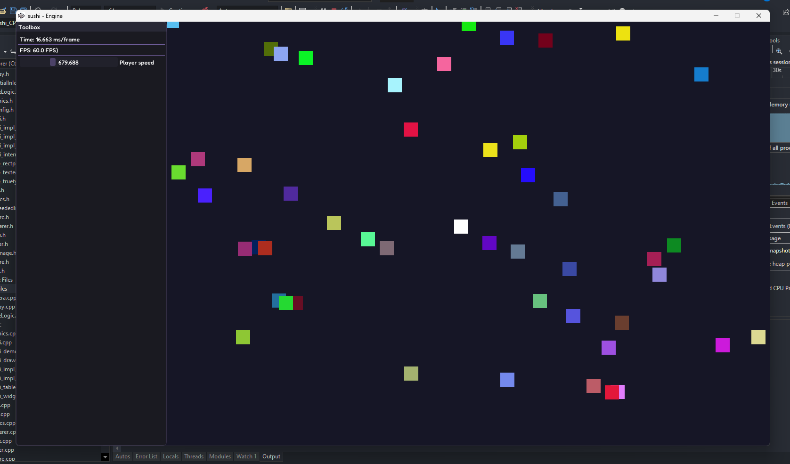

# Sushi Engine 👾 
A source-code based 2d rendering engine. (Under development)

 * Uses OpenGL 3.3 for its API 
 * C++ programming languages
 * Tools: ImGUI, Glad, GLFW, Box2D

Compilation prerequisites: 

 * Visual Studio 2022 with C++ tools
 * The required .lib files (can be found at vendor folder)
 * OpenGL 3.3+ support
 * Tehcnically you can compile it under linux and macOS as well, but you need to deal with the compilation manually. The engine uses cross-platform libraries. 

 Currently, it can do:
 
 * Batch rendering
 * Drawing out coloured rectangles
 * ImGUI integration

 Sceenshot:
 